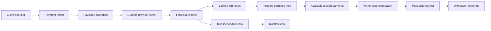
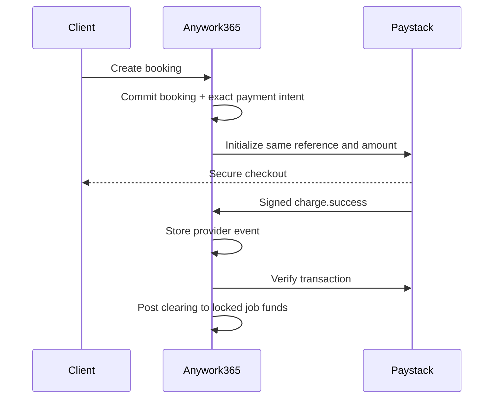
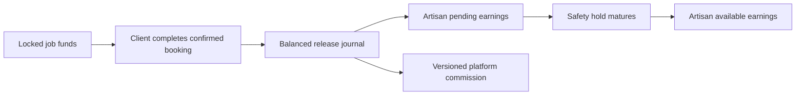
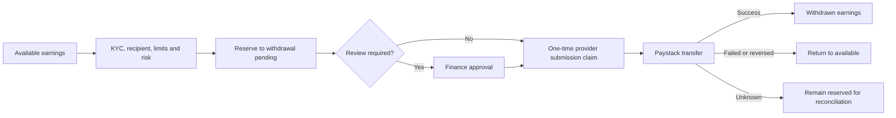
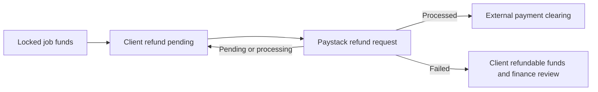
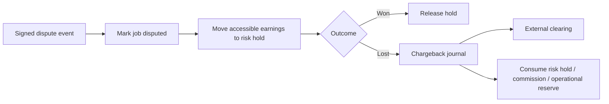
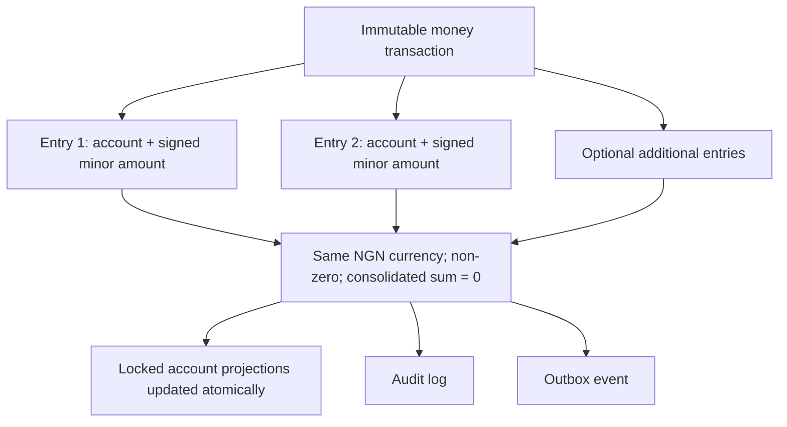
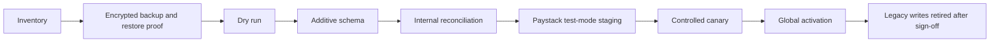
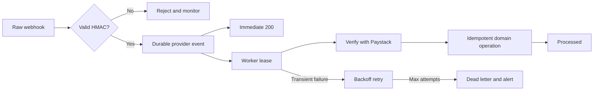
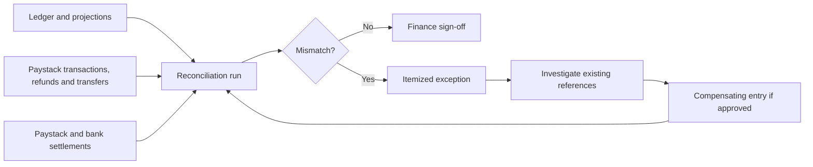

# Marketplace finance architecture

## Purpose and boundary

Anywork365 is a marketplace payment system, not a deposit account or
general-purpose money-transfer product. A client payment must identify one
booking. Clients cannot send an arbitrary cash-like balance to another user.
Paystack is the external collection, refund and transfer rail. The internal
ledger is the source of truth for rights and obligations inside Anywork365.

Legacy identifiers containing the term `escrow` describe historical database
objects only. The v3 product and implementation use **locked job funds**,
**pending earnings** and **available earnings**. This wording makes no claim
that Anywork365 provides a regulated escrow service.

## Authoritative records

- `money_transactions` is one immutable posted business event.
- `money_entries` is the immutable balanced journal.
- `money_accounts.balance_kobo` is a row-locked performance projection. It is
  checked against entries by reconciliation and is not independent truth.
- `marketplace_payment_intents`, `job_funds`,
  `marketplace_withdrawal_requests`, `refund_requests`,
  `financial_disputes` and `financial_chargebacks` hold workflow state.
- `provider_events` stores signed provider messages before processing.
- `financial_outbox_events` stores post-commit side effects.
- `financial_audit_logs` stores actor, action, resource and reason.

All monetary values are signed or unsigned `BIGINT` minor units as appropriate.
Application money calculations use `bigint`; API boundaries convert to safe
integers only where Paystack requires a JSON number. V3 supports NGN only.

## Account model

Account creation is internal and restricted to the allow-listed constructors in
`src/lib/financial/account-types.ts`. Accounts have an owner, purpose,
currency, classification and negative-balance policy. Client, artisan, booking,
platform and system accounts are separate. Only clearing, suspense, adjustment
and explicitly configured platform reserve accounts may become negative.

The journal uses a signed balance-delta convention: positive entries increase
the account projection and negative entries decrease it. Every posted
transaction must have at least two consolidated accounts and sum to zero.
`ledger_entries_view` exposes positive entries as credits and negative entries
as debits for reporting.

## Service boundaries

- `LedgerService`: the only v3 code allowed to insert entries or change account
  projections.
- Marketplace service: creates booking payment intents, confirms payments,
  locks and releases job funds, and releases matured earnings.
- Withdrawal service: recipient policy, reservations, approvals, provider
  submission claims and terminal posting.
- Refund service: provider submission and terminal refund handling.
- Risk service: dispute holds and chargeback postings.
- Provider event service: durable ingestion leases, retries and dead letters.
- Outbox service: post-commit notification delivery.
- Paystack gateway: normalized provider adapter.

Provider network calls happen outside database transactions. A durable intent,
reservation or claim is committed before the call. Unknown outcomes remain in a
non-spendable state until provider verification or finance review.

## Security and operational controls

- Raw-body HMAC verification precedes event ingestion.
- Payment amount, currency, environment, customer and metadata are verified
  against the internal intent.
- Unique references and request hashes prevent replay with changed parameters.
- Account and workflow rows are locked in deterministic order.
- Posted transactions and entries have database update/delete blockers.
- Full bank numbers are not retained in v3; only the Paystack recipient code
  and last four digits are stored.
- KYC, bank-name matching, bank-change delay, velocity limits and risk holds
  gate withdrawals.
- Admins cannot directly edit balances. Corrections require a typed reversal or
  adjustment operation with an audit reason.

## Availability design

Workers are invoked by a protected scheduler endpoint. Provider events and
outbox messages use leases, bounded exponential retry and dead-letter states.
Reconciliation checks balanced journals, account projections, locked job funds,
payment-to-ledger links, withdrawal reservations and stale work. Alerts must be
configured externally for dead letters, reconciliation failures and worker
silence before production activation.

## Detailed flows

### Funding

### Job-fund release

### Withdrawal

### Refund

### Dispute and chargeback

### Ledger transaction structure

### Migration

### Webhook processing

### Reconciliation

